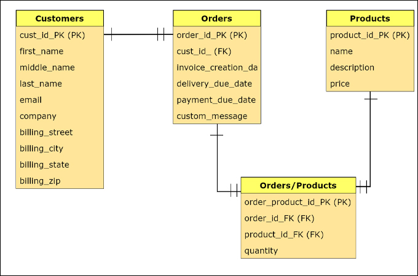

# Intro to Databases

## What is a database?

Companies rely heavily on data to make decisions. Data is the lifeblood of a company. It is the information that is collected from the customers, the employees, the products, the services, and the environment. Data is collected from all these sources and stored in a database.

A database is a collection of data that is organized so that it can be easily accessed, managed and updated.

## Types of databases

There are many types of databases. The most common ones are:

- Flat file databases (CSV, JSON, XML)
- Relational databases (SQL)
- Non-relational databases (NoSQL)

### Flat file databases

- Data is stored in a plain text file
- Separated by commas, tabs, or other characters
- Simple data

### Relational databases (SQL)

- Stands for Structured Query Language
- The most popular type of datavase of the last few decades
- The data is broken down into tables with associations between them (relationships)
- Each table is like a spreadsheet with rows and columns
- Language that makes it possible to easily manage the requested data

Most popular relational databases:

- MySQL
- PostgreSQL
- SQLite
- Microsoft SQL Server

#### DDL (Data Definition Language)

Create and modify the structure of the database.

- `CREATE TABLE`
- `ALTER TABLE`
- `DROP TABLE`

#### DML (Data Manipulation Language)

Manipulate the data in the database.

- `INSERT`
- `UPDATE`
- `DELETE`
- `SELECT`

### Non-relational databases (NoSQL)

- NoSQL stands for "Not only SQL"
- Minimally structured data
- Data can be stored in key-value pairs

Most popular non-relational databases:

- MongoDB
- CouchDB
- Redis
- Cassandra
- Amazon DynamoDB

## Difference between SQL and NoSQL

| SQL                                                                                                 | NoSQL                                                                                                                                                            |
| --------------------------------------------------------------------------------------------------- | ---------------------------------------------------------------------------------------------------------------------------------------------------------------- |
| Relational databases                                                                                | Non-relational databases                                                                                                                                         |
| Structured Query Language                                                                           | Unstructured Query Language                                                                                                                                      |
| Table based databases                                                                               | Document based, key-value pairs, graph databases or wide-column stores                                                                                           |
| Predefined schema                                                                                   | Dynamic schema for unstructured data                                                                                                                             |
| Uses SQL (structured query language) for defining and manipulating the data, which is very powerful | Unstructured data is stored as a collection of key-value pairs, documents, graph databases or wide-column stores. Queries are focused on collection of documents |

## Basics of Relational Databases

| Name | Email           | First Partner | Second Partner | Project Name      | Project URL                     |
| ---- | --------------- | ------------- | -------------- | ----------------- | ------------------------------- |
| John | john@doe.com    | Jane          | Bob            | Midterm TinyLinks | github.com/johndoe/tinyLinks    |
| Jane | jane@smith.com  | John          | Bob            | Midterm TinyLinks | github.com/janesmith/tinyLinks  |
| Bob  | bob@johnson.com | Jonh          | Jane           | Midterm TinyLinks | github.com/bobjohnson/tinyLinks |

### The problem

- Repeating data
- Hundreds of users with many projects each
- Some projects are in groups, some individual
- Adding more information to the table like comments, date delivered, etc. will make it more complex

### Organizing data for better storage

Terms:

- **Database**: A collection of tables
- **Table**: A table is a collection of related data held in a table format within a database. It consists of columns and rows.
- **Column**: A column is a vertical set of data values in a table. Each column has a name and a data type.
- **Row**: A row is a horizontal set of data values in a table. Each row has a unique ID.

> Below is a more complex example of a database with several tables. The key thing to note is that these are multiple tables, each with their own columns and rows. They are linked together because there is related data between the tables. This forms the database.



So, the basics:

- a database has many tables
- which has many columns
- with many rows
- that contain our data

Our sample data is already presented in a table, so it has some clues for us about how we should eventually organize it. Still, we should get specific about what we need to address.

### Updating for repititions

- What if we spelled the student's name wrong in the original data? What kind of issues could that cause?
- What if groups change for other projects?

### Putting the relational in relational databases

- Information should be grouped by necessity
- If we break into 2 tables, we can have a table for users and a table for projects. What information would we need to store in each table?

#### Users table

| Name | Email           |
| ---- | --------------- |
| John | john@doe.com    |
| Jane | jane@smith.com  |
| Bob  | bob@johnson.com |

#### Projects table

| Project Name | Student Name | First Partner | Second Partner | Project URL                     |
| ------------ | ------------ | ------------- | -------------- | ------------------------------- |
| Midterm      | John         | Jane          | Bob            | github.com/johndoe/tinylinks    |
| Midterm      | Jane         | John          | Bob            | github.com/janesmith/tinylinks  |
| Midterm      | Bob          | Jane          | John           | github.com/bobjohnson/tinylinks |

> We haven't changed too much, but we have made it so that we can easily add more information to the projects table without having to change the users table. We can also easily add more users without having to change the projects table.

We still have a problem though. What if we misspell a name? Would we get the same result if we search for one of the partners?

### Primary and Foreign keys

Luckily, **primary** and **foreign keys** save us from this particular problem, as well as many others. Instead of just storing the information we need, we can store information that helps us stay organized.

#### Primary key (PK)

- A primary key is a column (or a combination of columns) that uniquely identifies each row in a table.
- The primary key must contain unique values.
- The primary key column cannot contain NULL values.
- It can be anything, but most people use numbers of some sort, often in a column labelled `something_id`.

For instance, we'll add a `student_id` column to our table:

| student_id (PK) | name | email           |
| --------------- | ---- | --------------- |
| 1               | John | john@doe.com    |
| 2               | Jane | jane@smith.com  |
| 3               | Bob  | bob@johnson.com |

#### Foreign key (FK)

- A foreign key is a column (or a combination of columns) that uniquely identifies a row/record in another table.
- The foreign key must contain values that exist in the primary key column of another table.
- The foreign key column can contain NULL values.

| Project Name | Student (FK) | First Partner (FK) | Second Partner (FK) | Project URL                     |
| ------------ | ------------ | ------------------ | ------------------- | ------------------------------- |
| Midterm      | 1            | 2                  | 3                   | github.com/johndoe/tinylinks    |
| Midterm      | 2            | 1                  | 3                   | github.com/janesmith/tinylinks  |
| Midterm      | 3            | 2                  | 1                   | github.com/bobjohnson/tinylinks |

> Notice that we have replaced the names with the `student_id` from the `students` table. This is a foreign key. We can now easily add more students to the `students` table without having to change the `projects` table. We can also easily add more projects without having to change the `students` table.

## SQL Syntax / Commands

### Create a database

```sql
CREATE DATABASE database_name;
```

### Create a table

```sql
CREATE TABLE table_name (
  column1 datatype,
  column2 datatype,
  column3 datatype
);
```

### Insert data into a table

```sql
INSERT INTO table_name (column1, column2, column3)
VALUES (value1, value2, value3);
```

### Select data from a table

```sql
SELECT column1, column2, column3
FROM table_name;
```

### Select data from a table with a condition

```sql
SELECT column1, column2, column3
FROM table_name
WHERE column1 = value1;
```

### Select data from a table with multiple conditions

```sql
SELECT column1, column2, column3
FROM table_name
WHERE column1 = value1
AND column2 = value2;
```

```sql
SELECT column1, column2, column3
FROM table_name
WHERE column1 = value1
OR column2 = value2;
```

### Subqueries IN

- The IN operator allows you to specify multiple values in a WHERE clause.

```sql
SELECT column1, column2, column3
FROM table_name
WHERE column1 IN (value1, value2, value3);
```

### Group by

- The GROUP BY statement groups rows that have the same values into summary rows, like "find the number of customers in each country".

```sql
SELECT column1, column2, column3
FROM table_name
GROUP BY column1;
```

### Order by

- The ORDER BY keyword is used to sort the result-set in ascending or descending order.

```sql
SELECT column1, column2, column3
FROM table_name
ORDER BY column1;
```

### Having

- The HAVING clause was added to SQL because the WHERE keyword could not be used with aggregate functions.

```sql
SELECT column1, column2, column3
FROM table_name
GROUP BY column1
HAVING column1 = value1;
```

### SQL Functions

- `COUNT()` - Counts the number of rows that matches a specified criteria.
- `SUM()` - Sums the values in a column.
- `AVG()` - Returns the average value of a numeric column.
- `MIN()` - Returns the smallest value of the selected column.
- `MAX()` - Returns the largest value of the selected column.

### Order of operations - Select

- `FROM`
- `JOIN`
- `ON`
- `WHERE`
- `GROUP BY`
- `HAVING`
- `ORDER BY`

## Exercises

- [SQL](https://www.khanacademy.org/computing/computer-programming/sql) - SQL Basics and More Advanced SQL queries Sections
- [SQL Zoo](http://sqlzoo.net/) - Exercise 1, 2, 3 and 5

### Aditional Resources

- [Relational Database for Dummies](http://code.tutsplus.com/tutorials/relational-databases-for-dummies--net-30244)
