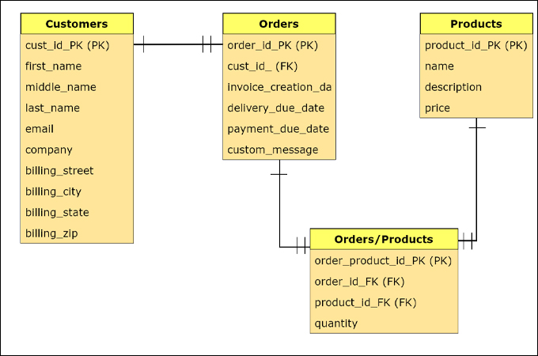

# Database Design

## What is a database design?

[Database Design Definition](https://en.wikipedia.org/wiki/Database_design)

Creating a Relational Database requires more up front planning than normal software development. Making changes to the rules and tables after the database has already been created can be quite difficult, so we really want to get things right the first time. Luckily for us, designing relational databases is something that people have been doing since the 70s, so there are processes that we can follow to get things right.

There are processes that help us to determine which tables our database will have, and how our tables will relate to each other. And there are standards for creating visual diagrams to help us model our data. All of this is encompassed within the field of database design.

## Database Normalization

Database normalization allows us to realize one of the major benefits of relational databases. We normalize our database to reduce duplicate data. Today, we will learn about how to normalize our database.

### Denormalized Data

It is incredibly difficult to manage a database that stores the same information in several places. Let's imagine that we stored our student data **denormalized**.

| id  | name              | class_name |
| --- | ----------------- | ---------- |
| 1   | Sam Billings      | FEB12      |
| 2   | Susan Hudson      | MAR12      |
| 3   | Malloy Jenkins    | APR09      |
| 4   | Maximilian Alesio | APR09      |
| 5   | Pegasus Larue     | APR09      |

We would consider this denormalized because the class name is repeated for 3 of the students. In order to normalize this database we would split the data into two related tables. If a class name changes, then we must update all rows with than name. This can get incredibly complex, especially for larger databases.

### Normalized Data

Students table:

| id  | name              | class_id |
| --- | ----------------- | -------- |
| 1   | Sam Billings      | 1        |
| 2   | Susan Hudson      | 2        |
| 3   | Malloy Jenkins    | 3        |
| 4   | Maximilian Alesio | 3        |
| 5   | Pegasus Larue     | 3        |

Class table:

| id  | name  |
| --- | ----- |
| 1   | FEB12 |
| 2   | MAR12 |
| 3   | APR09 |

We still show that each student belongs to a class, but the details of the class are stored separately. When we need to gather this information together, we use a query to ask the database for it in the structure that we want. This is when we start joining tables together.

If we needed to change the name of a class for any reason we only need to change the one field in the classes table.

> It is normal to create more tables when normalizing a database.

Normalizing our database reduces duplicate or redundant data and improves data integrity. This process usually involves the creation of new tables in our database.

There are many normal forms that we can follow, but at this point, we don't need to know them all or necessarily follow them all. The most important thing to understand is **why** we would normalize our database. **To enforce data integrity reduce duplication, and make it easier to manage our data.**

[Normalization in database with example](https://blog.udemy.com/normalization-in-database-with-example/)

[First normal form - LinkedIn Learning Video](https://www.youtube.com/watch?v=6Jr1ya1kWWE&ab_channel=LinkedInLearning)

## Relationships between tables

While designing a database, we're going to end up with lots and lots of tables. We have to determine how the tables relate to one another. The relationships between tables are based on **primary keys** and **foreign keys**. The two main types of relationships between tables are **one-to-many** and **many-to-many**.

### One-to-many

[One-to-many relationship](https://www.youtube.com/watch?v=-C2olg3SfvU&ab_channel=DatabaseStar)

When defining relationships between tables we will often want to create a one-to-many relationship. An example of this is a class having many students.

Let's take a step back from relational databases for a moment, and think about how we would model this data in JavaScript. A class has many students. A reasonable way of doing this would be to have a class object with a students array:

```js
const class = {
  name: "FEB02",
  students: ["Armand Hilll", "Stephanie Wolff"],
};
```

The class has many things, so we might add an array to classes. This works well in JavaScript, but works terribly in relational databases. Our classes table can't contain an array of students, that's just not how these databases work. Instead, we will accomplish this relationship by adding a single row that contains a single value to a single table. We place a foreign key on the students table that points to a record in the classes table.

```text
       MANY                            ONE
+-----------------+            +-----------------+
|     students    |            |     classes     |
+-----------------+            +-----------------+
| PK | id         |       /----| PK | id         |
|    | name       |      /     |    | name       |
|    | email      |\    /      |    | start_date |
| FK | class_id   |----/       |    | end_date   |
|    | start_date |/           +-----------------+
|    | end_date   |
+-----------------+
```

So instead of altering the classes, we alter the students. This is much different than our JavaScript approach because we are using a foreign key.

#### Foreign Key

A foreign key is a field in one table that refers to a primary key in another table. Foreign keys are how we model relationships in a relational database. When we have a one-to-many relationship, the foreign key goes on the many side. So when a class has many students, the foreign key goes on the students side.

### Many-to-many

[Many-to-many Relationships in DB](https://www.youtube.com/watch?v=1eUn6lsZ7c4&ab_channel=DatabaseStar)

Imagine our requirements change and a student is also suddenly able to have many classes.

- A student can have many classes.
- A class can have many students.

This is now a many-to-many relationship. But in a relational database, we have no way of directly modeling a many-to-many relationship. Instead, we turn this into **two** one-to-many relationships using a 'join' table.

```text
       ONE                         MANY                      ONE
+-----------------+        +-----------------+       +-----------------+
|     students    |        | classes_students|       |     classes     |
+-----------------+        +-----------------+       +-----------------+
| PK | id         |--\     | PK | id         |\   /--| PK | id         |
|    | name       |   \   /| FK | class_id   |---/   |    | name       |
|    | email      |    \---| FK | student_id |/      |    | start_date |
| FK | class_id   |       \+-----------------+       |    | end_date   |
|    | start_date |                                  +-----------------+
|    | end_date   |
+-----------------+
```

This is a very basic example where our join table only contains two foreign keys. But it could contain many foreign keys and any other data that would help model our relationship.

Look at the following join table:

```text
+------------------------+
|  assistance_requests   |
+------------------------+
| PK | id                |
|    | name              |
| FK | student_id        | A student has many assistance requests.
| FK | instructor_id     | A instructor accepts many assistance requests.
| FK | assignment_id     |
|    | created_at        |
|    | started_at        |
|    | completed_at      |
|    | student_rating    |
|    | instructor_rating |
+------------------------+
```

This is a join table that represents the many-to-many relationship between students and instructors.

- A `instructor` can help many `students`.
- A `student` can be helped by many `instructor`.

## ERD

To better understand how the tables in a relational database are connected to each other, we can use an ERD, or Entity Relationship Diagram. This is a kind of diagram that shows each table as a box. It links those boxes together indicating what kind of relationship they have with each other, such as one-to-many or one-to-one.

An Entity Relationship Diagram helps us design the schema of a database. We can use a pen and paper, a whiteboard or an online tool like `draw.io`. The key is to iterate on the design before committing it to the database. This is a situation where we **ALWAYS** save time by planning.

> **Always** design a database using an ERD before writing any code.



The key information that must be present in an ERD:

- Names of the Entities.
- Attributes / properties for the Entities.
- The relations between each entity.

## Naming conventions

We use naming conventions to increase consistency which provides us with some level of predictability. We can write queries faster if we don't have to look up column names constantly.

- Use `snake_case` for table and column names.
- Pluralize tables names, column names should be singular.
- Call your primary key `id`.
- For most foreign keys use `<table>_id`.

```text
+----------------+
|    students    |  <-- Plural
+----------------+
| PK | id        |  <-- Primary Key
|    | name      |  <-- Singular
| FK | class_id  |  <-- <table>_id
+----------------+
```

# PostgreSQL

## What is PostgreSQL?

PostgreSQL is a powerful, open source object-relational database system. It has more than 15 years of active development and a proven architecture that has earned it a strong reputation for reliability, data integrity, and correctness.

It is where we will store our data, create tables, entities, and relationships between them.

## How to install it?

### Windows

1. Download the installer from [here](https://www.postgresql.org/download/windows/).

2. Run the installer and follow the steps.

3. When you get to the screen where you can choose the components to install, make sure to select the following:

   - PostgreSQL Server
   - Stack Builder
   - pgAdmin 4

4. Follow this step-by-step to set `psql` available in your terminal: [Click here](https://blog.sqlbackupandftp.com/setting-windows-path-for-postgres-tools/)

> It is using an older version of PostgreSQL, but the steps are the same.

5. Open terminal and type `psql` to check if it is working.

### Mac

1. Follow the steps from [here](https://postgresapp.com/).

2. Close and reopen your terminal.

3. Run `psql` in your terminal to check if it is installed.

## Useful commands

- `\c` - Connect to a database

- `\l` - List all databases

- `\dt` - List all tables in the current database

- `\d` - List all tables in the current database

- `\d <table_name>` - List all columns in a table

- `\i <file_name>` - Execute a file

- `\x` - Toggle expanded outputs

- `\q` or `ctrl+C` - Quit psql

- `ctrl+L` - Clear the screen

- `crtl+U` - Clear the current line

# Exercise - Week Assignment

[Assignment Link](https://classroom.github.com/a/qJe-Bois)

## Activities

1. Create a new database called `week_assignment` or whatever you want to call our app using `psql`.

2. Create the tables for our `students` and `classes` entities.

   - Create a folder called `migrations` within the `week_assignment` folder.
   - Inside `migrations`, create a file called `01_students_classes.sql`.
   - Write the SQL queries to create the tables for the `students` and `classes` entities. Use the ERD to help.
   - From your psql session, type `\i migrations/students_classes.sql` to execute the file.
   - Now enter `\dt` into your psql session to make sure the two tables have been created.

3. Import the students' and classes' data from the `seeds` folder into the database.

   - From your psql session, type `\i seeds/students_seeds.sql` to execute the file.
   - Do the same for classes.
   - Now enter `SELECT count(*) FROM students;` and `SELECT count(*) FROM classes;` into your psql session to make sure the students and classes have been imported.

4. Commit all your changes and push them to GitHub.

5. Get all students without a Github username.

   - Create a file called `01_get_students_without_github.sql` in the `queries` folder.
   - Show only `id`, `name`, `email` and `class_id` columns.
   - Order them by `class_id`.
   - Execute the file and check the results.

   > Remember to create a new file for each query.

6. Get all students in a specific class.

   - Create a file called `02_get_students_in_class.sql` in the `queries` folder.
   - Show only `id` and `name` columns.
   - Order them by their name in alphabetical order.
   - Since this query needs to work with any specific class, just use any number for the class_id.
   - Execute the file and check the results.

7. Select the total number of students who were in the first 3 classes.

8. Get all of the students that don't have an email or phone number.

9. Get all of the students without a `gmail.com` account and a phone number.

10. Get all of the students currently enrolled.

    - Get their `name`, `id` and `class_id`.
    - Order them by `class_id`.

11. Get all graduates without a linked Github account.

    - Get their `name`, `email` and `phone`.

12. Write the CREATE TABLE statements for the assignments and a assignment_submissions tables.

    - Create a file called `02_assignments_assignment_submissions.sql` in the `migrations` folder.
    - Write the SQL queries to create the tables for the `assignments` and `assignment_submissions` entities. Use the ERD to help.
    - From your psql session, type `\i migrations/assignments.sql` to execute the file.
    - Now enter `\dt` into your psql session to make sure the two tables have been created.

13. Import the assignments' and assignment submissions' data from the `seeds` folder into the database.

    - From your psql session, type `\i seeds/assignments_seeds.sql` to execute the file.
    - Do the same for assignment submissions.
    - Now enter `SELECT count(*) FROM assignments;` and `SELECT count(*) FROM assignment_submissions;` into your psql session to make sure the students and classes have been imported.

14. Commit and push your changes to GitHub.
